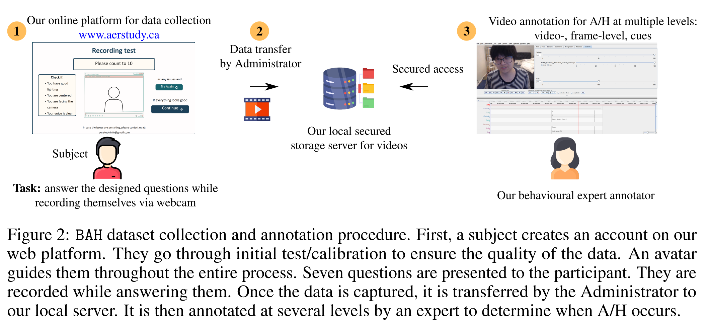

### Pytorch code for zero-shot precition of Ambivalence/Hesitancy in BAH paper cited below. 

# [*BAH* Dataset for Ambivalence/Hesitancy Recognition in Videos for Digital Behavioural Change (ICLR2026)](https://arxiv.org/pdf/2505.19328)
by
**Manuela González-González<sup>3,4</sup>,
Soufiane Belharbi<sup>1</sup>,
Muhammad Osama Zeeshan<sup>1</sup>,
Masoumeh Sharafi<sup>1</sup>,
Muhammad Haseeb Aslam<sup>1</sup>,
Alessandro Lameiras Koerich<sup>2</sup>,
Marco Pedersoli<sup>1</sup>,
Simon L. Bacon<sup>3,4</sup>,
Eric Granger<sup>1</sup>**

<sup>1</sup> LIVIA, Dept. of Systems Engineering, ETS Montreal, Canada
<br/>
<sup>2</sup> LIVIA, Dept. of Software and IT Engineering, ETS Montreal, Canada
<br/>
<sup>3</sup> Dept. of Health, Kinesiology, \& Applied Physiology, Concordia University, Montreal, Canada
<br/>
<sup>4</sup> Montreal Behavioural Medicine Centre, CIUSSS Nord-de-l’Ile-de-Montréal, Canada


<p align="center"></p>
<!-- <br/> -->
<p align="center"></p>

[](https://sbelharbi.github.io/bah-dataset)
[](https://arxiv.org/pdf/2505.19328)
[](https://huggingface.co/sbelharbi/bah-dataset)

## Abstract
Ambivalence and hesitancy (A/H), a closely related construct, is the primary
reasons why individuals delay, avoid, or abandon health behaviour changes.
It is a subtle and conflicting emotion that sets a person in a state between
positive and negative orientations, or between acceptance and refusal to do
something. It manifests by a discord in affect between multiple modalities or
within a modality, such as facial and vocal expressions, and body language.
Although experts can be trained to recognize A/H as done for in-person
interactions, integrating them into digital health interventions is costly and
less effective. Automatic A/H recognition is therefore critical for the
personalization and cost-effectiveness of digital behaviour change interventions.  
However, no datasets currently exists for the design of machine learning models
to recognize A/H.
This paper introduces the Behavioural Ambivalence/Hesitancy (*BAH*) dataset
collected for multimodal recognition of A/H in videos.  
It contains 1,427 videos with a total duration of 10.60 hours captured from 300
participants across Canada answering predefined questions to elicit A/H. It is
intended to mirror real-world online personalized behaviour change interventions.
 *BAH* is annotated by three experts to provide timestamps that
indicate where A/H occurs, and frame- and video-level annotations with A/H cues.
 Video transcripts, cropped and aligned faces, and participants' meta-data are
 also provided. Since A and H manifest similarly in practice, we provide a binary
 annotation indicating the presence or absence of A/H.
Additionally, this paper includes benchmarking results using  baseline models on
*BAH* for frame- and video-level recognition, zero-shot prediction, and
personalization using source-free domain adaptation. The limited performance
highlights the need for adapted multimodal and spatio-temporal models for A/H
recognition. Results for specialized methods for fusion are shown to assess the
presence of conflict between modalities, and for temporal modelling for
within-modality conflict are essential for better A/H recognition.
The data, code, and pretrained weights are publicly available.


**Code: Pytorch 2.2.2**


## Citation:
```
@inproceedings{gonzalez-25-bah,
  title={{BAH} Dataset for Ambivalence/Hesitancy Recognition in Videos for Digital Behavioural Change},
  author={González-González, M. and Belharbi, S. and Zeeshan, M. O. and
    Sharafi, M. and Aslam, M. H and Pedersoli, M. and Koerich, A. L. and
    Bacon, S. L. and Granger, E.},
  booktitle={ICLR},
  year={2026}
}
```


## Overview
This code provides the baseline results for the Video Level Classification on the BAH dataset with Zero Shot LVLM.
This code leverages the VideoLLaVA-7B model to perform binary emotion classification on videos. It supports multiple prompting strategies including definition-based and transcript-augmented approaches.

## Features

- Binary emotion classification (Ambivalent vs Non-Ambivalent)
- Multiple prompting strategies with varying levels of context
- Support for video transcripts to enhance classification
- Reproducible results with fixed random seeds
- Performance metrics (F1-score)

## Requirements

### Dependencies

```bash
pip install torch torchvision
pip install transformers
pip install av
pip install pandas
pip install scikit-learn
pip install numpy
pip install Pillow
```

### Hardware

- CUDA-compatible GPU (recommended)
- Sufficient VRAM for 7B model (16GB+ recommended)

## Installation

1. Clone this repository:
```bash
git clone <repository-url>
cd video-ambivalence-classification
```


2. The model will be automatically downloaded from HuggingFace on first run.

## Usage

### Basic Usage

```bash
python video_ambivalence_classifier.py \
  --test_file /path/to/test_file.txt \
  --videos_root /path/to/videos/directory \
  --prompt_flag td1 \
  --output_dir ./results
```

### Arguments

| Argument | Type | Required | Default | Description |
|----------|------|----------|---------|-------------|
| `--test_file` | str | Yes | - | Path to test file containing video paths, labels, and transcripts |
| `--videos_root` | str | Yes | - | Root directory containing the video files |
| `--prompt_flag` | str | No | `td1` | Prompt type (see below) |
| `--output_dir` | str | No | `./output` | Directory to save output CSV files |
| `--gpu` | str | No | `0` | GPU device ID to use |

### Prompt Types

The `--prompt_flag` parameter controls the prompting strategy:

- **`s`** (Simple): Basic classification prompt without context
- **`d1`** (Definition 1): Includes definition of ambivalence as contradictory feelings
- **`d2`** (Definition 2): Includes definition focusing on desires for/against change
- **`td1`** (Transcript + Definition 1): Combines video transcript with first definition
- **`td2`** (Transcript + Definition 2): Combines video transcript with second definition

### Input File Format

The test file should be a CSV-like text file with the following format:

```
video_path,label,transcript
path/to/video1.mp4,0,This is the transcript for video 1
path/to/video2.mp4,1,This is the transcript for video 2
```

Where:
- `video_path`: Relative path to video file (from `videos_root`)
- `label`: Ground truth label (0 = Non-Ambivalent, 1 = Ambivalent)
- `transcript`: Text transcript of the video (can be empty for non-transcript prompts)

## Output

The script generates two CSV files in the output directory:

1. **`predictions_{prompt_flag}.csv`**: Contains video paths and predicted labels
   - `video_path`: Full path to video file
   - `response`: Predicted label (0 or 1)

2. **`ground_truth_labels.csv`**: Contains video paths and ground truth labels
   - `video_path`: Full path to video file
   - `label`: Ground truth label (0 or 1)

### Console Output

The script prints:
- Progress for each video

- Model performance metrics (Accuracy and F1-score)
- File save locations

## Examples

### Example 1: Simple Prompt
```bash
python video_ambivalence_classifier.py \
  --test_file data/test_300.txt \
  --videos_root /datasets/videos \
  --prompt_flag s \
  --output_dir results/simple
```


## Reproducibility

The code sets random seeds for reproducibility:
- PyTorch seed: 42
- NumPy seed: 42
- CUDNN deterministic mode: Enabled
- CUDNN benchmark mode: Disabled

## Performance Metrics

The script calculates:
- **F1-Score**: Macro-averaged F1-score

## Troubleshooting

### Out of Memory Error
- Reduce batch size (currently processes one video at a time)
- Use a GPU with more VRAM
- Try CPU mode (slower but uses system RAM)

### Video File Not Found
- Verify `--videos_root` path is correct
- Check that paths in test file are relative to `videos_root`
- Ensure video files exist and are readable

### Model Download Issues
- Ensure internet connection for first-time model download
- Check HuggingFace credentials if using gated models
- Verify sufficient disk space (~15GB for model)


